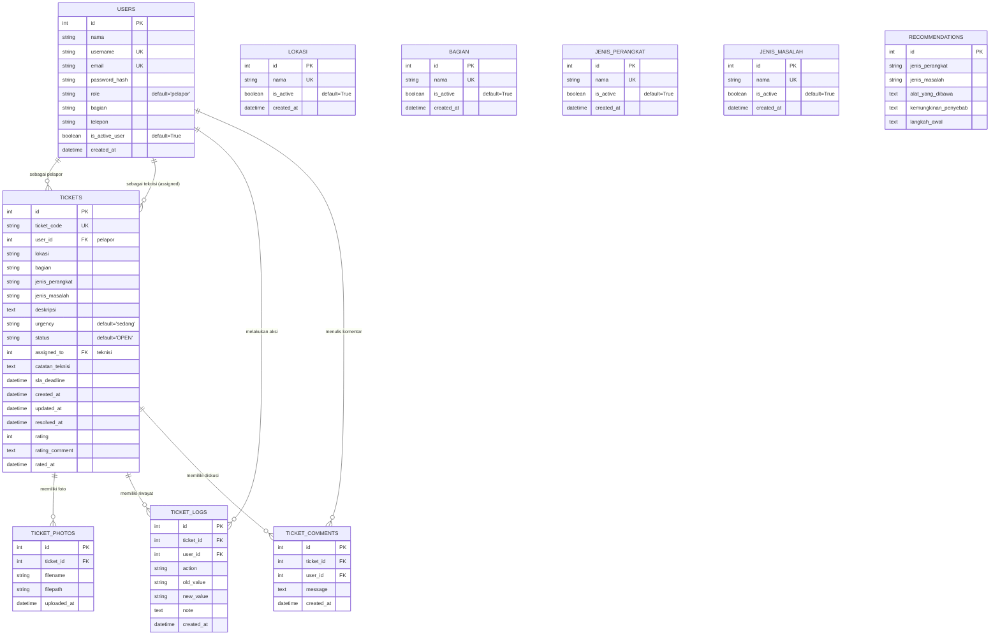

```mermaid
erDiagram
    USERS ||--o{ TICKETS : "sebagai pelapor"
    USERS ||--o{ TICKETS : "sebagai teknisi (assigned)"
    USERS ||--o{ TICKET_LOGS : "melakukan aksi"
    USERS ||--o{ TICKET_COMMENTS : "menulis komentar"
    
    TICKETS ||--o{ TICKET_PHOTOS : "memiliki foto"
    TICKETS ||--o{ TICKET_LOGS : "memiliki riwayat"
    TICKETS ||--o{ TICKET_COMMENTS : "memiliki diskusi"
    
    USERS {
        int id PK
        string nama
        string username UK
        string email UK
        string password_hash
        string role "default='pelapor'"
        string bagian
        string telepon
        boolean is_active_user "default=True"
        datetime created_at
    }
    
    TICKETS {
        int id PK
        string ticket_code UK
        int user_id FK "pelapor"
        string lokasi
        string bagian
        string jenis_perangkat
        string jenis_masalah
        text deskripsi
        string urgency "default='sedang'"
        string status "default='OPEN'"
        int assigned_to FK "teknisi"
        text catatan_teknisi
        datetime sla_deadline
        datetime created_at
        datetime updated_at
        datetime resolved_at
        int rating
        text rating_comment
        datetime rated_at
    }
    
    TICKET_PHOTOS {
        int id PK
        int ticket_id FK
        string filename
        string filepath
        datetime uploaded_at
    }
    
    TICKET_LOGS {
        int id PK
        int ticket_id FK
        int user_id FK
        string action
        string old_value
        string new_value
        text note
        datetime created_at
    }
    
    TICKET_COMMENTS {
        int id PK
        int ticket_id FK
        int user_id FK
        text message
        datetime created_at
    }
    
    LOKASI {
        int id PK
        string nama UK
        boolean is_active "default=True"
        datetime created_at
    }
    
    BAGIAN {
        int id PK
        string nama UK
        boolean is_active "default=True"
        datetime created_at
    }
    
    JENIS_PERANGKAT {
        int id PK
        string nama UK
        boolean is_active "default=True"
        datetime created_at
    }
    
    JENIS_MASALAH {
        int id PK
        string nama UK
        boolean is_active "default=True"
        datetime created_at
    }
    
    RECOMMENDATIONS {
        int id PK
        string jenis_perangkat
        string jenis_masalah
        text alat_yang_dibawa
        text kemungkinan_penyebab
        text langkah_awal
    }
```